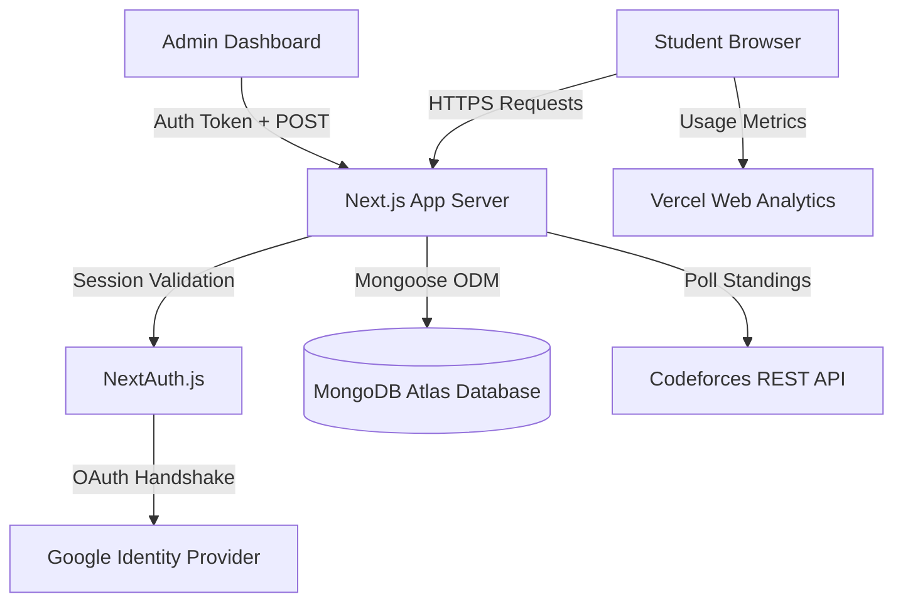
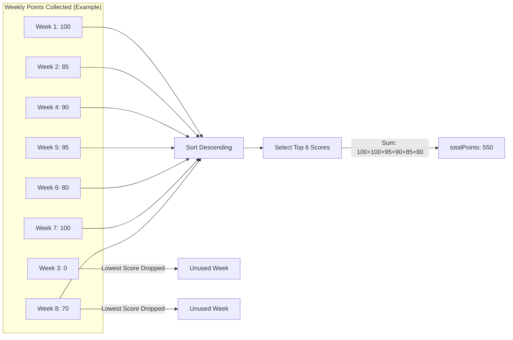
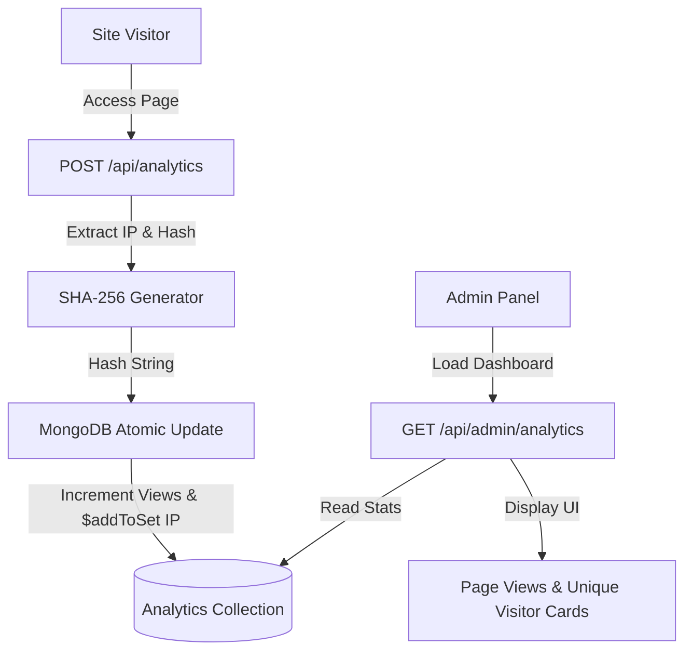

# CodeIIEST CP & DSA Summer Bootcamp 2026 (Season 01)

<div align="center">

```text
 ██████╗  ██████╗ ██████╗ ███████╗██╗██╗███████╗███████╗████████╗
██╔════╝ ██╔═══██╗██╔══██╗██╔════╝██║██║██╔════╝██╔════╝╚══██╔══╝
██║      ██║   ██║██║  ██║█████╗  ██║██║█████╗  ███████╗   ██║   
██║      ██║   ██║██║  ██║██╔══╝  ██║██║██╔══╝  ╚════██║   ██║   
╚██████╗ ╚██████╔╝██████╔╝███████╗██║██║███████╗███████║   ██║   
 ╚═════╝  ╚═════╝ ╚═════╝ ╚══════╝╚═╝╚═╝╚══════╝╚══════╝   ╚═╝   
              ⚡ CP & DSA Summer Bootcamp Portal ⚡
```

[](https://nextjs.org)
[](https://react.dev)
[](https://typescriptlang.org)
[](https://mongodb.com)
[](https://vercel.com/analytics)
[](LICENSE)

An elegant, high-performance, and feature-rich Web Portal and Admin Control Panel designed for **CodeIIEST** to conduct, manage, and track its annual **8-Week Competitive Programming and DSA Summer Bootcamp**.

[Explore Platform Features](#-key-features) • [Developer Setup](#%EF%B8%8F-local-development-setup) • [API Directory](#-api-endpoint-reference) • [Database Architecture](#%EF%B8%8F-core-database-schema-reference)

</div>

---

## 🌟 Key Features & System Design

### 🚀 Student Portal & User Experience
* **Secure Google OAuth:** Real-time session generation via **NextAuth.js** (Auth.js v5) supporting institutional domains.
* **Auto Institutional Onboarding:** Instant roll identifier parsing (e.g., `2024EEB109` automatically yields batch 2028, enrollment 2024, and Electrical Engineering).
* **One-Click Codeforces handshake:** Secure, instant validation of participant handles via public Codeforces API checks.
* **Responsive Leaderboard:** Highly responsive, paginated, and real-time scoreboard with inline search filters.
* **Gamified Profiles:** Dynamic user cards with Codeforces ratings, current milestones, and allocated bootcamp houses (**Turing**, **Dijkstra**, **Lovelace**, **Von Neumann**).

---

### 🛠️ Administrative & CMS Control Suite
* **Automated Standings Sync:** Live contest pulling using Codeforces standing endpoints and group structures.
* **Preview ── Edit ── Commit Flow:** Visual verification panel comparing raw CF data with matched bootcamp players before writing changes.
* **Multi-Week Score Manager:** Administrative spreadsheet grid for manual adjustments, reverts, or score overrides.
* **Curriculum CMS:** Timing locks, editorial upload interfaces, and Google Meet integration for weekly bootcamp topics.
* **Privileged RBAC:** Role-based access control protecting secure APIs and admin routes with high-priority check layers.

---

### 📊 Platform Infrastructure Architecture


---

### 🧮 Dynamic Best-N Score Calculation Model
To make the standings fair and accommodate missed contests, total points are dynamically evaluated as the sum of the student's **top 6 out of 8 weekly contests**:



---

### 📊 Real-Time Visitor Metrics & Logging
* **Vercel Web Analytics:** Injected at layout root to track rendering speeds and page transitions.
* **Anonymized IP Analytics:** Logs hits privately using local `SHA-256` hashing (zero raw IP collection, GDPR compliant).
* **Metrics Board:** Sleek UI display inside the admin dashboard showing active counts:



---

## 🏗️ Technical Stack

* **Core Framework:** Next.js 16.2.6 (App Router), React 19.2.4, TypeScript 5.x
* **Database & ORM:** MongoDB, Mongoose ODM 9.6.2
* **Authentication:** NextAuth.js (Auth.js v5 Beta) with Google OAuth 2.0
* **Styling & Aesthetics:** Vanilla CSS with glassmorphism panels, dark mode palette, micro-animations, and Geist typography.
* **Component Library:** Customized Radix UI primitives (`Avatar`, `Dialog`, `Dropdown`, `Select`, `Tooltip`, `Toaster` by Sonner).
* **Integrations:** Codeforces public API, Vercel Web Analytics

---

## 📂 Folder Structure

```text
codeiiest-bootcamp/
├── src/
│   ├── app/                      # Next.js App Router Pages & API Routes
│   │   ├── admin/                # Admin Panel pages (Sync, Scores, Contests, CMS)
│   │   ├── api/                  # Backend endpoints
│   │   │   ├── admin/            # Role-protected admin actions
│   │   │   │   ├── analytics/    # Admin metrics retriever (GET)
│   │   │   │   ├── contests/     # Manage synchronized contests (GET/DELETE)
│   │   │   │   ├── scores/       # Batch score management (GET/DELETE)
│   │   │   │   └── sync-contest/ # Handshake preview and DB commit pipeline (POST)
│   │   │   ├── analytics/        # Public visitor log hit endpoint (POST)
│   │   │   └── sessions/         # Public course CMS info (GET)
│   │   ├── leaderboard/          # Public participant scoreboard
│   │   ├── onboarding/           # New student profile creation wizard
│   │   └── profile/              # User dashboard & statistics page
│   ├── components/               # React components
│   │   ├── admin/                # Admin layouts, grids, and controllers
│   │   ├── home/                 # Hero elements, timelines, and feature panels
│   │   ├── layout/               # Global Navbar, Footer, and Page wrappers
│   │   └── ui/                   # Shared primitives (Logo, Splash intro, Avatar)
│   ├── lib/                      # Core helpers (Mongoose client, CF handshakes, parsers)
│   └── models/                   # Mongoose Database Models (User, Session, Contest, Analytics)
├── scripts/                      # DB administration scripts (Seeding, Promotion)
├── public/                       # Static media, icons, and verification files
└── package.json                  # NPM dependencies & task configurations
```

---

## 🛠️ Local Development Setup

### 1. Prerequisites
Ensure you have **Node.js** (v18 or higher) and **NPM** installed on your workstation. A running instance of **MongoDB** (local server or MongoDB Atlas cluster) is required.

### 2. Clone the Repository
```bash
git clone https://github.com/CodeIIEST/CodeIIEST-Summer_Bootcamp.git
cd CodeIIEST-Summer_Bootcamp/codeiiest-bootcamp
```

### 3. Install Dependencies
```bash
npm install
```

### 4. Setup Environment Variables
Create a `.env.local` file in the root directory and populate the required parameters:

```env
# Database
MONGODB_URI=mongodb+srv://<username>:<password>@cluster0.mongodb.net
MONGODB_DB_NAME=codeiiest_bootcamp

# NextAuth.js Configuration
# Generate a secure secret using: openssl rand -base64 32
AUTH_SECRET=your_auth_secret_key_here
NEXTAUTH_URL=http://localhost:3000

# Google OAuth Credentials (obtain from Google Cloud Console)
AUTH_GOOGLE_ID=your_google_client_id_here
AUTH_GOOGLE_SECRET=your_google_client_secret_here

# App Deployment URLs
NEXT_PUBLIC_APP_URL=http://localhost:3000
```

### 5. Run Database Seeding
Populate the database with the default weekly curriculum topics, timing bounds, and session templates:
```bash
npm run seed
```

### 6. Run the Development Server
```bash
npm run dev
```
Open [http://localhost:3000](http://localhost:3000) in your web browser to view the application.

---

## 🚀 Database Management Scripts

The repository includes custom Node.js utility scripts located under the `scripts/` directory for database administration:

### 🌟 Promote User to Admin/Superadmin
Elevate any registered user profile to administrative status by running:
```bash
npm run promote:superadmin
# You will be prompted to provide the registered student email address.
```

### 🔄 Reset Synced Contests
Roll back score synchronization states or wipe contest histories safely:
```bash
npm run reset:contest
```

---

## 🔌 API Endpoint Reference

### Public API Endpoints

#### 📈 Log Visitor Hit
* **Endpoint:** `POST /api/analytics`
* **Description:** Atomically logs a home page hit. Extracts the user's IP address from headers, hashes it with standard `SHA-256` to secure visitor privacy, and logs it.
* **Response:**
```json
{ "success": true }
```

#### 📅 Fetch Weekly Curriculum Sessions
* **Endpoint:** `GET /api/sessions`
* **Description:** Retrieves all course sessions for the 8-week curriculum.
* **Response:**
```json
{
  "sessions": [
    {
      "weekNumber": 1,
      "topic": "Time Complexity & STL Basics",
      "isUnlocked": true,
      "editorialUrl": "https://codeiiest.in/editorials/week1",
      "meetUrl": "https://meet.google.com/abc-defg-hij",
      "contestId": 521458
    }
  ]
}
```

---

### Admin-Protected API Endpoints (Requires Admin Session)

#### 📊 Fetch Visitor and Metrics Statistics
* **Endpoint:** `GET /api/admin/analytics`
* **Description:** Fetches real-time total page views and unique visitor statistics.
* **Response:**
```json
{
  "views": 15420,
  "uniqueVisitors": 1289
}
```

#### 🎛️ Preview Codeforces Standings
* **Endpoint:** `POST /api/admin/sync-contest/preview`
* **Description:** Performs a dry-run sync. Fetches standing rows from the Codeforces API, matches user handles, computes scores, and flags unregistered handles.
* **Payload:**
```json
{
  "contestId": 521458,
  "weekNumber": 1,
  "groupId": 10245
}
```
* **Response:**
```json
{
  "contestName": "Bootcamp Contest 01",
  "syncedRows": 45,
  "unmatchedHandles": ["fake_handle_123"],
  "bootcampParticipants": [
    {
      "email": "2024eeb109@iiests.ac.in",
      "displayName": "Shivam",
      "cfHandle": "Anon_thefool",
      "solved": 5,
      "penalty": 140,
      "score": 100
    }
  ]
}
```

---

## 🗃️ Core Database Schema Reference

### 👤 User Schema (`src/models/User.ts`)
Tracks student profile information, verified handles, and weekly scores.
* **Identity:** Google Account associations, email, displayName.
* **Institutional:** Roll number, graduation batch year, automatic department string parsing.
* **Codeforces:** Verified CF handle, current CF rating, avatar URL.
* **Bootcamp Stats:**
  * `scores`: array of size 8 representing week 1 to 8 points.
  * `weeklyRanks`: standings rank of the student in each weekly contest.
  * `totalPoints`: computed cumulative score (sum of the top 6 scoring weeks).

### 📅 Session Schema (`src/models/Session.ts`)
Controls the CMS data for the weekly CP curriculum.
* `weekNumber`: number (1 through 8).
* `topic`: topic title (e.g., "Advanced Graphs & Flows").
* `isUnlocked`: boolean visibility control.
* `editorialUrl`, `editorialTitle`: resources for problem analysis.
* `meetUrl`: meeting link for live lectures.
* `contestId`: linked Codeforces contest ID.

### 📉 Analytics Schema (`src/models/Analytics.ts`)
Aggregates performance stats and site traffic.
* `views`: total website page views.
* `uniqueIpHashes`: array of SHA-256 anonymized client IP hashes to ensure unique visitor counting.

---

## 🔒 Security Practices
* **Anonymized IP Analytics:** IP hashes are generated in memory using standard SHA-256 before writing to the database. Raw IP coordinates are immediately discarded and never stored.
* **NextAuth Security Hooks:** Administrative APIs and private pages execute NextAuth server-side session checks to guarantee authorization before loading database contents.
* **Connection Pooling:** Integrates mongoose caching globally across lambdas to prevent Mongo server connection exhaustion.

---

## 💡 Troubleshooting & Common Issues

### 1. MongoDB Connection Exhaustion
If you encounter `MongooseError: Connection timed out` on dev reloads or serverless functions:
> **Solution:** Ensure your code imports `connectToDatabase` from `@/lib/mongoose`. This helper utilizes a global cache pointer that pools connections across hot-reloads in development and serverless container warmups.

### 2. NextAuth Google Authentication Fails
If login triggers an OAuth error or authentication redirects to a mismatch landing page:
> **Solution:** Confirm that your production domains or `http://localhost:3000` are added to the **Authorized JavaScript origins** and **Authorized redirect URIs** (`/api/auth/callback/google`) in the Google Cloud API Console credentials dashboard.

---

*Made with ♥ by the **CodeIIEST Dev Team**.*
