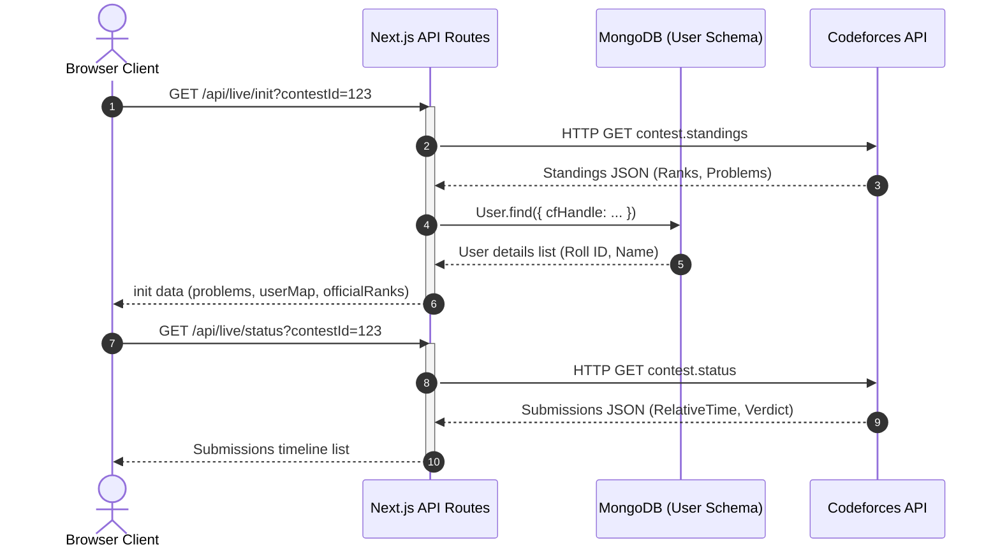
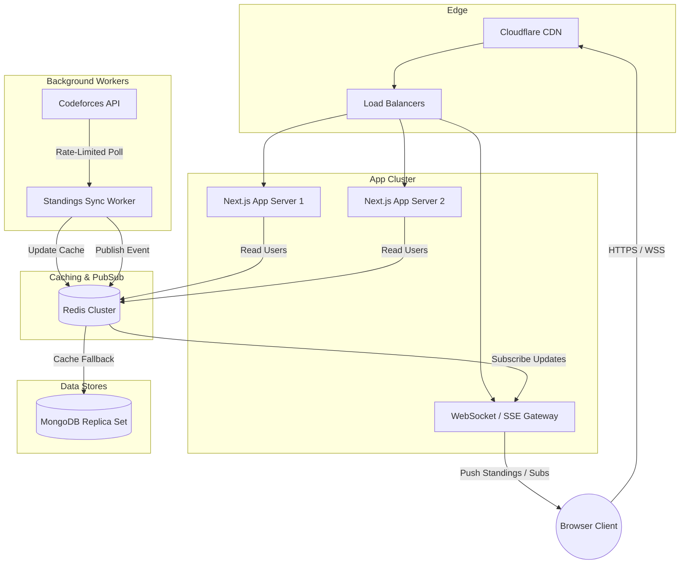

# System Design & Technical Report: Live Scoreboard Platform

This document serves as the complete technical report and system design guide for the CodeIIEST Summer Bootcamp Live Standings & Replay Dashboard. It details the implemented frontend and backend features, current data flow pipelines, and architectural frameworks necessary to scale the platform to support millions of concurrent users.

---

## 1. System Overview & Context

The CodeIIEST Summer Bootcamp Standings Platform is a real-time analytics panel that visualizes student performance in Codeforces contests. The system provides two main modes of operation:
* **Live Mode:** Used during ongoing contests to track students' current positions both locally within the bootcamp and globally in the official Codeforces standings.
* **Replay Mode:** Used post-contest to replay submissions minute-by-minute, simulating a live dashboard for past contests. This is used for review sessions and mock contest analyses.

---

## 2. In-Depth Feature Analysis & Layout Specifications

Below is the detailed technical specification of the newly implemented features on the dashboard.

### A. Dynamic Official Codeforces Ranks Column

In competitive programming, students want to track their position within their local peer group (Local Bootcamp Rank) and compare it against the global participant pool (Official Codeforces Rank).

#### Implementation Details
* **Toggle Condition:** The visibility of the official rank column is governed by the state variable `showCFRankCol`.
  $$\text{showCFRankCol} = (\text{mode} == \text{'live'}) \lor (\text{mode} == \text{'replay'} \land \text{currentTime} \ge \text{durationSeconds})$$
* **Grid and Width Calculation:**
  * To accommodate the column without layout shifting, table header grids and absolute row elements adjust their inline CSS widths dynamically.
  * In the **Dark Theme**, the column occupies a width of `75px`.
  * In the **ICPC Light Theme**, the column occupies a width of `85px` with a distinct background `#f8f9fa` matching the DOMjudge scoreboard style.
* **Missing Rank Representation:** If a student has no entry in the global standings (e.g. they registered for the bootcamp database but did not start the contest on Codeforces), the cell defaults to `—` (em-dash).

---

### B. Stacked flex Participant Column (Leaderboard Style)

The participant cell displays both user details and Codeforces statistics in a unified block, aligning with the design of the main Leaderboard page.

#### UI Composition
* **Name Subrow:** Displays the participant's display name (`row.displayName` or first name). If the contestant ranks in positions 1 to 3 locally, they receive gold, silver, or bronze medal tags.
* **Codeforces Subrow:** Displays `@handle` and rating (e.g., `@Shivam · 1650`).
* **Codeforces Rank Coloring:** Handled by wrapping the handle text in the `<CFHandle />` component:
  * Gray (`#808080`) for Rating $< 1200$ (Newbie)
  * Green (`#008000`) for Rating $[1200, 1399]$ (Pupil)
  * Cyan (`#03a89e`) for Rating $[1400, 1599]$ (Specialist)
  * Blue (`#0000ff`) for Rating $[1600, 1899]$ (Expert)
  * Purple (`#aa00aa`) for Rating $[1900, 2099]$ (Candidate Master)
  * Orange (`#ff8c00`) for Rating $[2100, 2399]$ (Master/IM)
  * Red (`#ff0000`) for Rating $\ge 2400$ (Grandmaster/LGM)

---

### C. Clickable Profile Links with Underline Isolation

Every participant row is wrapped in a link pointing to their Codeforces profile page.

#### Properties
* **Anchor Element Configuration:**
  ```html
  <a 
    href={`https://codeforces.com/profile/${row.handle}`} 
    target="_blank" 
    rel="noopener noreferrer" 
    className="flex flex-col justify-center gap-0.5 group/link"
    style={{ textDecoration: 'none', color: 'inherit', outline: 'none' }}
  >
  ```
  * `target="_blank"`: Opens the profile in a new tab to preserve the standings state and current replay timer position.
  * `rel="noopener noreferrer"`: Eliminates tab-nabbing security vulnerabilities.
* **Underline Isolation:** To prevent underlines from cutting through the Codeforces colored handle and rating strings, Tailwind CSS nested hover states were implemented.
  * The parent anchor is marked with `group/link`.
  * The name text `span` is marked with `group-hover/link:underline`.
  * **Result:** Hovering anywhere on the contestant card triggers a text-underline *only* on the participant's name, leaving the sub-labels intact.

---

### D. Absolute Positioned Hover Tooltips

To display user metadata (Full Name, Roll ID, Codeforces rating, and rank title) without layout shifts, we designed custom tooltip cards.

#### CSS Clipping Prevention
* The table columns use `overflow: 'visible'` to allow tooltips to render outside the table row containers.
* The tooltips are absolutely positioned relative to the parent participant cell:
  * **Positioning:** `position: 'absolute', left: '16px', bottom: '90%', marginBottom: '6px', zIndex: 30`
  * **Pointer Interception Prevention:** `pointerEvents: 'none'` ensures the tooltip does not intercept hover states when the mouse moves across the row.

---

### E. Replay-End Official Sorting

The default sorting ranks participants by their local performance at `currentTime` (number of solved problems descending, penalty minutes ascending).

#### Algorithm
When the replay completes, the sorting shifts to official standings:
```typescript
const isReplayFinished = mode === 'replay' && currentTime >= (contest?.durationSeconds || 0);

const sorted = Array.from(rows.values()).sort((a, b) => {
  if (isReplayFinished) {
    const rankA = officialRanks[a.handle.toLowerCase()] ?? Infinity;
    const rankB = officialRanks[b.handle.toLowerCase()] ?? Infinity;
    if (rankA !== rankB) {
      return rankA - rankB; // Ascending: rank 1 first, rank 2 second...
    }
  }
  if (a.points !== b.points) return b.points - a.points;
  return a.penalty - b.penalty; 
});
```
Using `Infinity` as a fallback ensures that any unranked participant is placed at the bottom of the list.

---

### F. Dark Theme Live Feed Refinements

The `LiveQueue` component displays live submission statuses. The row backgrounds were refactored to align with dark theme aesthetics.

#### Styling Declarations
* **Dynamic Row Backgrounds:**
  * Light Theme AC: `rgba(96,231,96,0.06)`
  * Light Theme Non-AC: `#ffffff`
  * Dark Theme AC: `rgba(96,231,96,0.04)`
  * Dark Theme Non-AC: `transparent` (reveals the underlying panel background `#09090c`)
* **Problem Badges:** The problem badges (e.g. `A`, `B`) transition from hardcoded indigo (`#1a237e`) to `isDark ? 'rgba(255,255,255,0.08)' : '#1a237e'`.

---

## 3. Low-Scale (Current) Architecture

Currently, the application runs on a Next.js full-stack framework with a server-side route model.

### Data Flow Diagram



---

## 4. High-Scale Production System Design (Scale: 10M+ Users)

To scale this platform to support large-scale live programming contests (such as ICPC Regionals or global Codeforces mirrors) with millions of active viewers, we must resolve third-party rate limiting, database query contention, and browser rendering bottlenecks.

### High-Scale Architecture Blueprint



---

### A. Caching Architecture & BullMQ Sync Worker

Direct calls to Codeforces per request will trigger rate limits. 

#### Sync Worker
A dedicated process runs independent of the web server. It fetches data from Codeforces at a constant rate (e.g. every 10 seconds).
```
[Codeforces API] 
       | (Poll standings/status every 10-15s)
       v
[Sync Worker Daemon]
       |
       v (Normalize & Compress JSON)
[Redis Cluster] <-- (Next.js server queries only from Redis cache)
```

* **Redis Keys:**
  * `contest:metadata:{contestId}`: Contest config, active problems list.
  * `contest:submissions:{contestId}`: Normalized array of submission timeline event JSONs.
  * `contest:official-ranks:{contestId}`: Serialized key-value pairs mapping handles to current ranks.

---

### B. Real-Time Push Engine (WebSockets / Server-Sent Events)

Instead of browsers polling the server, updates are pushed down to clients.

* **SSE Gateway:** An event server (Node.js/Fastify) maintains persistent connections.
* **Redis Pub/Sub:** The background worker publishes updates to Redis:
  ```bash
  PUBLISH contest:channel:123 '{"type": "SUBMISSION", "data": {...}}'
  ```
* **Event Dispatching:** The SSE server receives the update and instantly pushes it to all active connections.

---

### C. Frontend Window Virtualization (DOM Scaling)

With thousands of active rows, rendering every participant card in the DOM causes scroll latency.

* **Prerequisite:** Integrate `react-window` to render only the visible viewport row items.
* **Framer-Motion Optimization:** Disable layout animations on non-visible elements to keep CPU execution time below the $16\text{ms}$ frame budget.

---

### D. MongoDB Query Optimizations & Projections

Optimize queries to minimize read lock delays on user schemas:
* **Compound Indexing:**
  ```javascript
  db.users.createIndex({ cfHandle: 1, isCfVerified: 1, isOnboardingComplete: 1 })
  ```
* **Projections:** Only query relevant fields to reduce pipeline RAM overhead:
  ```typescript
  const users = await User.find(
    { cfHandle: { $exists: true, $ne: '' } },
    { displayName: 1, name: 1, rollId: 1, cfRating: 1, cfRank: 1 }
  ).lean();
  ```

---

## 5. Prerequisites & Scalability Checklist

| Category | Prerequisite | Recommended Standard / Technology | Target Metric |
| :--- | :--- | :--- | :--- |
| **API Caching** | Decoupled background polling | Redis ElastiCache / BullMQ | <10ms read latency |
| **DB Performance** | Sparse unique index & projections | MongoDB Atlas Cluster (M30+) | <50ms query resolver |
| **Edge Network** | Edge caching & DDoS protection | Cloudflare CDN & Rate Limiting | 99.99% edge hit rate |
| **Real-Time Delivery** | SSE / WebSocket connection managers | AWS API Gateway / Socket.io | 100k+ concurrent streams |
| **Browser Scaling** | DOM Row Virtualization | `react-window` / `react-virtual` | 60 FPS scrolling performance |
| **Monitoring** | Live traffic monitoring | Prometheus / Grafana / Datadog | Real-time threshold alerts |
